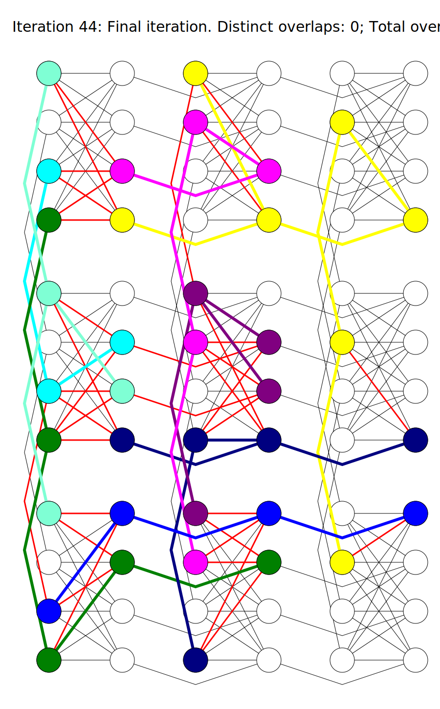

# Example project containing this library


## Build the example project
The project is built by default when building the root project.


## How it works
```example_majorminer.cpp``` contains the following code

```
#include <iostream>
#include <majorminer_lib.hpp>


using namespace majorminer;

int main()
{
  // Generate some source graph that should be embedded
  graph_t H = majorminer::generate_completegraph(8);

  // Generate the hardware graph
  graph_t G = majorminer::generate_chimera(3, 3);

  // For debugging purposes: Get us a visualizer
  ChimeraVisualizer vis{H, G, "imgs/example_majorminer/simple_example", 3, 3};

  // Embedd the problem
  EmbeddingSuite suite{H, G, &vis};
  embedding_mapping_t mapping = suite.find_embedding();

  // We can validate the embedding
  EmbeddingAnalyzer analyzer{mapping};
  std::cout << "Result has " << analyzer.getNbOverlaps() << " overlaps and uses "
    << analyzer.getNbUsedNodes() << " vertices." << std::endl;

  return 0;
}
```

Note that ```graph_t``` is just a ```typedef``` on ```Set<std::pair<fuint32_t, fuint32_t>>```. For ```Set<>```, we use oneTBB sets, i. e. ```tbb::unordered_set<>```.

In the code, we create the source graph ```H``` and the target graph ```G```, in this case a complete graph on ```n = 8``` vertices and a perfect Chimera graph consisting of ```3x3``` unit cells, respectively. For debugging purposes, we create a visualizer for the Chimera graph that outputs an image of the embedding in each iteration and pass those three objects to the ```EmbeddingSuite``` which tries to embedd ```H``` onto ```G```. The result of type ```embedding_mapping_t``` is a ```typedef``` on an ```UnorderedMultiMap<fuint32_t, fuint32_t>```, which in turn is a ```tbb::unordered_multimap```, containing a vertex in ```H``` as key and a vertex in ```G``` as value.

The embedding might not always be disjoint and can be analyzed using the ```EmbeddingAnalyzer```.

The result of the code above might look as follows
```
Result has 0 overlaps and uses 37 vertices.
```

The images are generated in the folder ```./imgs/example_majorminer/``` and the last could look as follows

