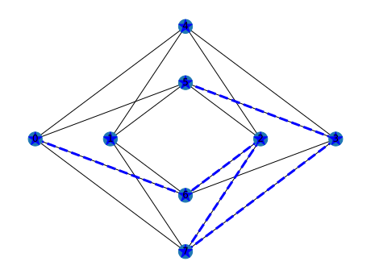

# Python evolutionary embedding

## Inputs
- `H`: Minor to embed
- `G`: Graph, e.g. a Chimera or Pegasus graph

## Algorithm
- First step: init basic path with length `n`
 (`n` is the number of nodes in the minor H)

- More to come